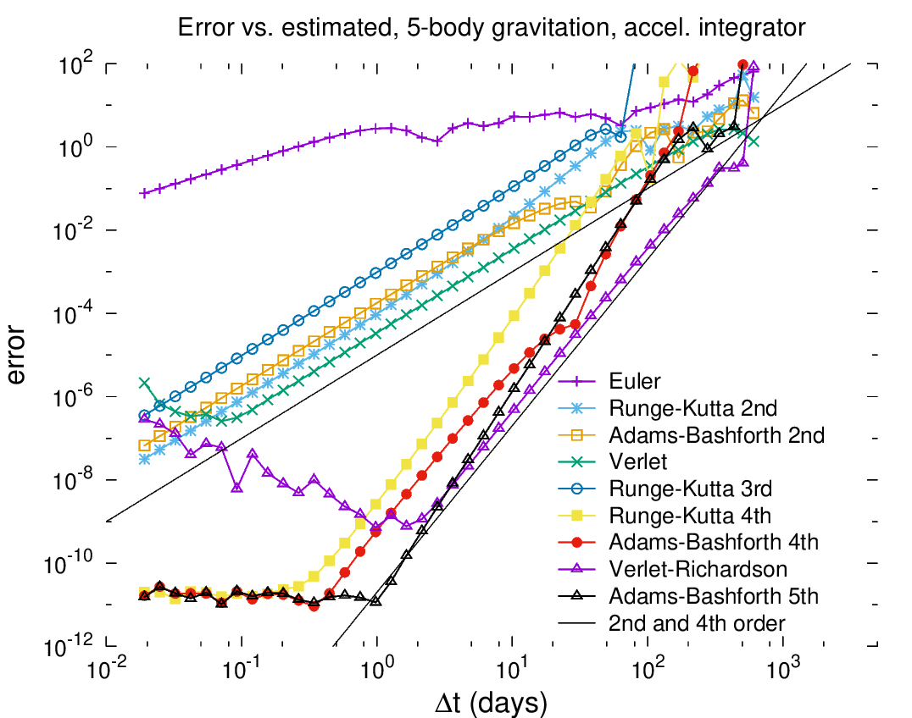
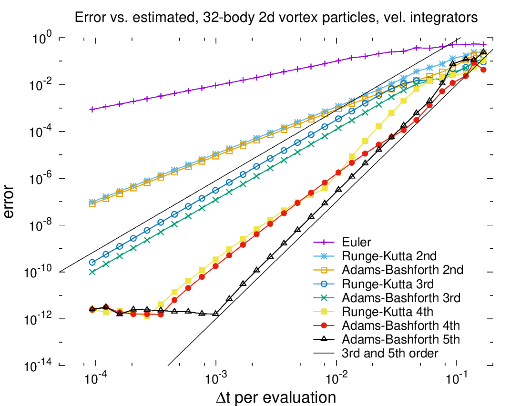

# multistep
Library for multistep and multistage integration of ODEs on vectors of numbers


### Description
This is a library and main routine for testing various multi-step and
multi-stage [forward integrators for ODEs](https://en.wikipedia.org/wiki/Numerical_methods_for_ordinary_differential_equations). It can perform integrations of several simple and canonical systems
using a wide range of time step sizes for the following integrators:
Euler,
[Runge-Kutta](https://en.wikipedia.org/wiki/Runge%E2%80%93Kutta_methods) 2nd (two types),
3rd (three tpyes),
and 4th order (two types),
[Adams-Bashforth](https://en.wikipedia.org/wiki/Linear_multistep_method) 2nd and 4th and 5th order,
[Standard Verlet](https://en.wikipedia.org/wiki/Verlet_integration),
a higher-order Richardson-Verlet, and a method from Hamming's "Numerical Methods for
Scientists and Engineers."

The Richardson-Verlet integrator may appear here for the first time.
It is a 4th order method using accelerations only,
manages better error than AB4 with the same history, and much better error than
RK4 when the force calculation dominates the computational effort.
It's only disadvantage is that for very small time step sizes, 
roundoff error in a subtraction prevents the total error from continuing 
to drop, as it does with AB4 and RK4. But this only surfaces with relative
errors close to machine precision. It excels at RMS errors of 1e-4 to
1e-6, where it delivers similar accuracy with 1/3rd the computational
effort of RK4, and no increased error at very large time steps like
AB5.

### Compile and run
Compile and run multistep with the following commands on an RPM-based system:

    sudo dnf install eigen3-devel
	git clone https://github.com/markstock/multistep.git
	cd multistep
	mkdir build
	cd build
	ccmake ..
    make
    ./runmultistep

### Performance
Short story: for gravitational systems, Verlet and Richardson-Verlet are the best;
Richardson-Verlet and AB5 outperforming other methods on the spring-mass system (ensemble of 100).
The Lennard-Jones results are averages over 100 electrons in one dimensional motion
and show Verlet as the best if errors of 1% or greater are acceptable, and Richardson-Verlet
if higher accuracy is required.





Note that the 3D gravitational test is drawn directly from the Computer Language Game's nbody problem,
see [here](https://benchmarksgame-team.pages.debian.net/benchmarksgame/performance/nbody.html)
and [here](https://programming-language-benchmarks.vercel.app/problem/nbody).
In that test, the five most massive bodies in the Solar System are simulated for 50,000 years using
Euler (1st order) time steps of 1/100th year. The fastest programs complete the 5 million steps in about 0.3 seconds.
The positional error in the CLG's benchmark results is no doubt massive, on the order of 10 AU, even though
that benchmark tracks only the energy error (which is much easier to maintain).
Instead, we run for only 100 years and vary the time step length.
To achieve even 0.1 AU mean positional error (which still means your probe will fail to intercept)
over a 100 year span using Euler integration, we had to use time steps of 36 minutes, or about 14700x
more time steps than the CLG's problem specification.
To get that same error, the Richardson-Verlet method needs to take a step only once every *8 months* of
simulation time, or 69x fewer steps than in the CLG benchmark.
This means that we can maintain accuracy while speeding up the calculation by a factor of 1 million, just
by using better numerical methods.
Note that 1e-11 AU is 5 feet, achievable with Adams-Bashforth 5th order using time steps of 1 day,
or 100 billion times more accurate than using the Euler method.

An important note is that in the program and the above plots, the multi*stage* (Runge-Kutta)
methods take 2x, 3x, and 4x longer time steps than the multi*step* methods.
This is so that we can compare the error to the computational effort,
as the Runge-Kutta methods perform more derivative evaluations per time *step*.
This means that the x-axis in the above plots can be directly compared to
computational effort.
In some plots, the x is labelled correctly as "delta t per evaluation."

### Future work
This is still a toy program, meant to test various forward integrators.
In the future, I hope to do the following:

* refactor to allow more RK3 and RK4 methods, and treat them correctly
* try a Kahan-summation-like scheme for reducing the roundoff error of the Richardson-Verlet method (add a few flops to account for roundoff)
* add another system with friction: damped and forced oscillator (to SpringMass)
* build a linkable library and use that to generate executables
* add Bulirsch-Stoer integrator, any others? Gear? RK10?
* include integrators with automatic time step adjustment (global first)
* develop integrator with local (element-wise) time-stepping (different repository: adapDt)
* support systems which have forcing terms on derivatives other than the highest (like friction, which is proportional to velocity in a force system)
* should calculation of the highest derivative come at the end of the current step or the beginning of the next one? The former would make for cleaner code.
* add 10-th order Runge Kutta from here: https://sce.uhcl.edu/rungekutta/ (needs 17 stages)
* add a jerk system, where the third time derivative is a function of the state
* consider calculating the "true" solution in quad precision, or long double (80 bits)
* can this architecture support implementing Richardson extrapolation by automatically creating a longer-time-step version?

### Other ODE libraries
We have to mention [BOOST's odeint](https://www.boost.org/doc/libs/1_78_0/libs/numeric/odeint/doc/html/index.html);
and [odeint-2](https://github.com/headmyshoulder/odeint-v2) which uses it to solve sample problems.

### Citing Multistep
I don't get paid for writing or maintaining this, so if you find this tool useful or mention it in your writing, please please cite it by using the following BibTeX entry.

```
@Misc{Multistep2022,
  author =       {Mark J.~Stock},
  title =        {Multistep:  Library for multistep and multistage integration of ODEs on vectors of numbers},
  howpublished = {\url{https://github.com/markstock/multistep}},
  year =         {2022},
  orcid =        {0000-0002-3494-8823}
}
```
