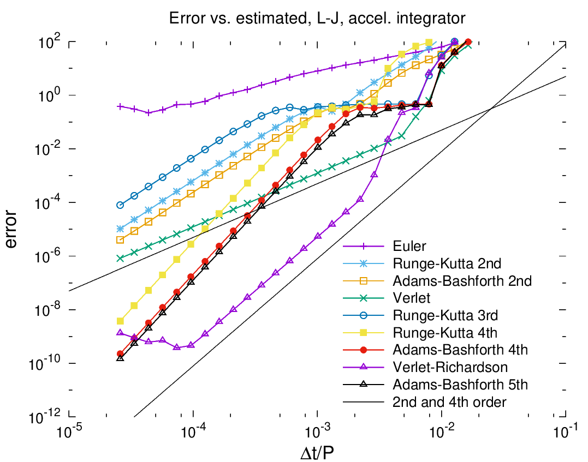

# multistep
Library for multistep and multistage integration of ODEs on vectors of numbers

### Description
This is a library and main routine for testing various multi-step and
multi-stage [forward integrators for ODEs](https://en.wikipedia.org/wiki/Numerical_methods_for_ordinary_differential_equations). It can perform integrations of several simple and canonical systems
using a wide range of time step sizes for the following integrators:
Euler, [Runge-Kutta](https://en.wikipedia.org/wiki/Runge%E2%80%93Kutta_methods) 2nd (two types)
and 3rd and 4th order,
[Adams-Bashforth](https://en.wikipedia.org/wiki/Linear_multistep_method) 2nd and 4th and 5th order,
[Standard Verlet](https://en.wikipedia.org/wiki/Verlet_integration),
a higher-order Richardson-Verlet, and a method from Hamming's "Numerical Methods for
Scientists and Engineers."

The Richardson-Verlet integrator may appear here for the first time.
It is a 4th order method using accelerations only,
manages better error than AB4 with the same history, and much better error than
RK4 when the force calculation dominates the computational effort.
It's only disadvantage is that for very small time step sizes, 
roundoff error in a subtraction prevents the total error from continuing 
to drop, as it does with AB4 and RK4. But this only surfaces with relative
errors close to machine precision. It excels at RMS errors of 1e-4 to
1e-6, where it delivers similar accuracy with 1/3rd the computational
effort of RK4, and no increased error at very large time steps like
AB5.

### Compile and run
Compile and run multistep with the following commands on an RPM-based system:

    sudo dnf install eigen3-devel
	git clone https://github.com/markstock/multistep.git
	cd multistep
	mkdir build
	cd build
	ccmake ..
    make
    ./runmultistep

### Performance
Short story: for gravitational systems, Verlet and Richardson-Verlet are the best;
Richardson-Verlet and AB5 outperforming other methods on the spring-mass system (ensemble of 100).
The Lennard-Jones results are averages over 100 electrons in one dimensional motion
and show Verlet as the best if errors of 1% or greater are acceptable, and Richardson-Verlet
if higher accuracy is required.

Note that in the test program and in the above plot, the multi*stage* methods take
2x, 3x, and 4x longer time steps;
this is so that we can compare the error to the computational effort,
as those methods perform more derivative evaluations per time *step*.
Also, something is clearly wrong with my implementation of RK3.

### Future work
This is still a toy program, meant to test various forward integrators.
In the future, I hope to do the following:

* try a Kahan-summation-like scheme for reducing the roundoff error of the Richardson-Verlet method (add a few flops to account for roundoff)
* build a linkable library and use that to generate executables
* add Bulirsch-Stoer integrator, any others? Gear?
* include integrators with automatic time step adjustment (global first)
* develop integrator with local (element-wise) time-stepping
* support systems which have forcing terms on derivatives other than the highest (like friction, which is proportional to velocity in a force system)
* should calculation of the highest derivative come at the end of the current step or the beginning of the next one? The former would make for cleaner code.

### Other ODE libraries
We have to mention [BOOST's odeint](https://www.boost.org/doc/libs/1_78_0/libs/numeric/odeint/doc/html/index.html);
and [odeint-2](https://github.com/headmyshoulder/odeint-v2) which uses it to solve sample problems.

